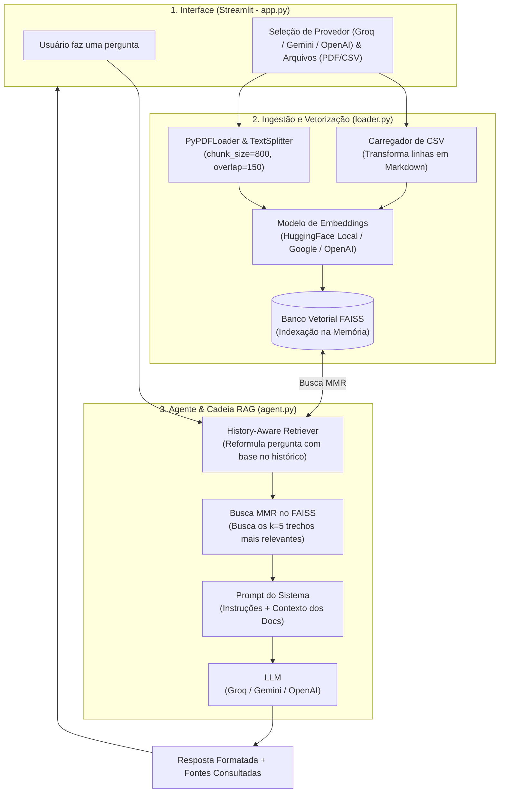
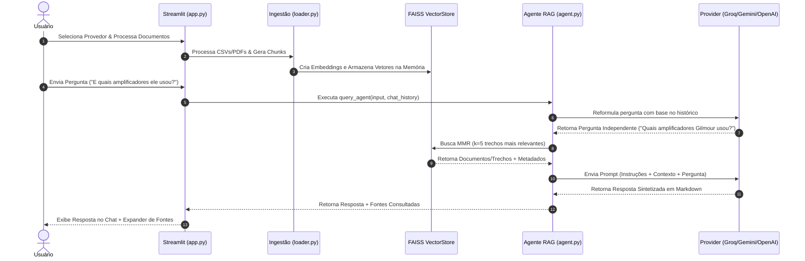

# 🤖 Agente IA Multiprovedor - Leitor RAG de PDFs & CSVs

Este projeto é uma aplicação interativa desenvolvida em Python e Streamlit que utiliza a arquitetura **RAG (Retrieval-Augmented Generation)** para permitir consultas inteligentes em documentos técnicos, manuais em formato PDF e tabelas estruturadas em CSV.

A solução é **multiprovedor**, permitindo alternar dinamicamente entre diferentes LLMs (**Groq, Google Gemini e OpenAI**) e modelos de Embeddings (**HuggingFace local, Google Embeddings e OpenAI Embeddings**).

---

## 🎯 Descrição Geral

O objetivo principal desta aplicação é responder a perguntas complexas extraindo informações precisas de arquivos CSV e PDFs carregados na memória. Por padrão, o sistema vem pré-configurado com dados detalhados sobre equipamentos de áudio, guitarras, amplificadores, pedais de efeito e timbres de grandes guitarristas (como David Gilmour, John Frusciante, Slash, Eddie Van Halen, Steve Vai, etc.).

### Principais Características
- **Multi-LLM**: Suporte para Groq (`llama-3.3-70b-versatile`), Google Gemini (`gemini-3.5-flash`, etc.) e OpenAI (`gpt-4o-mini`, etc.).
- **Embeddings Flexíveis**: Opção de usar HuggingFace local (`sentence-transformers/all-MiniLM-L6-v2`) inteiramente no computador/CPU sem custo adicional, ou APIs como Google Gemini e OpenAI.
- **Processamento Estruturado de CSV**: Cada linha de CSV é convertida em um documento legível contendo pares de chave-valor formatados e metadados por coluna.
- **Divisão Inteligente de PDFs**: Fragmentação de PDFs via `RecursiveCharacterTextSplitter` com preservação de sobreposição (*overlap*) de texto.
- **Busca por Relevância e Diversidade (MMR)**: O mecanismo de busca vetorial FAISS utiliza *Maximal Marginal Relevance* para evitar trechos duplicados e focar na informação mais completa.
- **Conversa Ciente de Histórico (*History-Aware*)**: Reescrita contextual de perguntas com base no histórico da sessão antes da busca nos vetores.
- **Transparência nas Fontes**: Exibição detalhada dos trechos e arquivos consultados para gerar cada resposta.

---

## 🏗️ Arquitetura da Solução

A arquitetura do projeto é baseada em 3 componentes principais: **Interface & Sessão (`app.py`)**, **Ingestão & Vetorização (`loader.py`)** e **Cadeia RAG & Agente (`agent.py`)**.



### 🔄 Diagrama de Sequência (Ciclo de Vida de uma Pergunta)



### Fluxo Detalhado de Funcionamento

1. **Ingestão de Dados (`loader.py`)**:
   - **CSV**: É lido via `pandas`. Cada linha vira um `Document` do LangChain com texto estruturado em formato Markdown e metadados contendo os valores originais das colunas.
   - **PDF**: O texto das páginas é extraído via `PyPDFLoader` (ou `pypdf.PdfReader` para buffers de memória) e fatiado em pedaços de 800 caracteres com sobreposição de 150 caracteres.
2. **Vetorização e Indexação (`loader.py`)**:
   - Os textos são convertidos em vetores numéricos (embeddings) pelo modelo escolhido (ex: `sentence-transformers/all-MiniLM-L6-v2`) e armazenados num índice **FAISS** em memória.
3. **Reformulação Contextual (`agent.py`)**:
   - Quando o usuário faz uma pergunta de acompanhamento (ex: *"E qual amp ele usou no próximo álbum?"*), o `create_history_aware_retriever` reescreve a pergunta para torná-la independente antes de buscar no FAISS.
4. **Recuperação e Geração (`agent.py`)**:
   - A busca é realizada no FAISS usando algoritmo **MMR** (`k=5`, `fetch_k=10`, `lambda_mult=0.7`).
   - Os documentos recuperados são injetados na variável `{context}` do template de prompt.
   - O LLM (Groq, Gemini ou OpenAI) sintetiza a resposta final em Markdown e cita os documentos/fontes.

---

## 🛠️ Tecnologias e Ferramentas

| Categoria | Tecnologia / Biblioteca | Descrição / Papel no Projeto |
| :--- | :--- | :--- |
| **Linguagem** | Python 3.10+ | Linguagem base da aplicação |
| **Interface Web** | Streamlit (`>=1.30.0`) | Framework para a criação da interface interativa de chat e sidebar |
| **Orquestração RAG** | LangChain (`>=0.1.0`) | Framework para construção de cadeias RAG, prompts e integração com LLMs |
| **Banco Vetorial** | FAISS (`faiss-cpu`) | Vector Store de alta performance para busca por similaridade vetorial |
| **Embeddings** | HuggingFace / Google / OpenAI | Modelos de geração de vetores (destaque para `sentence-transformers` local) |
| **Modelos de Linguagem (LLMs)** | Groq / Gemini / OpenAI | Integrados via `langchain-groq`, `langchain-google-genai` e `langchain-openai` |
| **Processamento de Dados** | Pandas (`>=2.0.0`) | Leitura e estruturação de arquivos CSV |
| **Processamento de PDFs** | PyPDF (`>=4.0.0`) | Extração de conteúdo textual de documentos PDF |
| **Configuração** | `python-dotenv` | Gerenciamento de variáveis de ambiente e chaves de API |

---

## 🚀 Instruções para Executar o Projeto

### Pré-requisitos

- **Python 3.10 ou superior** instalado na máquina.
- Chave de API do provedor desejado:
  - **Groq API Key** (Gratuita em [console.groq.com](https://console.groq.com)) — *Recomendado*
  - **Google AI Studio API Key** (Gratuita em [aistudio.google.com](https://aistudio.google.com))
  - **OpenAI API Key** ([platform.openai.com](https://platform.openai.com))

---

### Passo a Passo de Instalação e Execução

#### 1. Clonar o repositório ou navegar até a pasta do projeto:
```bash
cd /caminho/para/projeto-oracle-alura
```

#### 2. Criar e ativar um ambiente virtual (venv):

**No Linux/macOS:**
```bash
python3 -m venv .venv
source .venv/bin/activate
```

**No Windows (PowerShell):**
```powershell
python -m venv .venv
.venv\Scripts\Activate.ps1
```

#### 3. Instalar as dependências:
```bash
pip install -r requirements.txt
```

#### 4. Configurar as Variáveis de Ambiente (Opcional):
Crie um arquivo `.env` na raiz do projeto (ou copie do `.env.example`):
```env
GROQ_API_KEY=sua_chave_groq_aqui
GOOGLE_API_KEY=sua_chave_google_aqui
OPENAI_API_KEY=sua_chave_openai_aqui
```
*(Nota: As chaves também podem ser digitadas diretamente na interface web do Streamlit no momento da execução).*

#### 5. Iniciar a Aplicação Streamlit:
```bash
streamlit run app.py
```

A aplicação abrirá automaticamente no seu navegador no endereço `http://localhost:8501`.

---

## ❓ Exemplos de Perguntas que o Agente Consegue Responder

Como o banco de dados padrão inclui dados sobre equipamentos musicais (`guitar-equipments.csv` e `guitar-equipments.pdf`), o agente responde com precisão a perguntas como:

1. **Equipamento por Álbum/Era**:
   - *“Quais guitarras e pedais o David Gilmour usou no álbum The Wall?”*
2. **Comparativo entre Épocas**:
   - *“Compare os equipamentos e amplificadores do John Frusciante em Californication vs Stadium Arcadium.”*
3. **Especificidades Técnicas e Afinações**:
   - *“Qual é a afinação principal utilizada pelo Slash no álbum Appetite for Destruction e qual modelo de Marshall ele utilizou?”*
   - *“Quais pedais e pré-amps o Steve Vai utilizou no álbum Passion and Warfare?”*
4. **Efeitos e Modulações**:
   - *“Como Eddie Van Halen conseguia o famoso timbre 'Brown Sound' no primeiro álbum do Van Halen?”*

---

## 💬 Exemplos de Respostas Geradas pelo Agente

### Exemplo 1

**Pergunta:**
> *“Quais guitarras e pedais o David Gilmour usou no álbum The Wall?”*

**Resposta Gerada pelo Agente:**
> No álbum **The Wall (1979)**, David Gilmour utilizou os seguintes equipamentos de acordo com os documentos consultados:
>
> #### 🎸 Guitarras Principais:
> - **Fender Stratocaster 'Black Strat'**
> - **Gibson Les Paul Goldtop 1955** (com captadores P-90)
>
> #### 🎛️ Efeitos Chave:
> - **Electro-Harmonix Big Muff** (versão 'Ram's Head') — responsável pelos solos encorpados e com alto sustain.
> - **Electro-Harmonix Electric Mistress Flanger** — adicionando modulação sutil.
> - **MXR Digital Delay**
> - **MXR Dyna Comp** (compressor)
>
> #### 🔊 Amplificação:
> - Amplificador **Hiwatt DR103 100W**
> - Cabinet Rotativo **Yamaha RA-200**
> - Pré-amplificador **Alembic F-2B**
>
> ---
> **🔍 Fontes Consultadas:**
> - `Fonte: guitar-equipments.csv | Tipo: csv`
> - `Fonte: guitar-equipments.pdf | Tipo: pdf`

---

### Exemplo 2

**Pergunta:**
> *“Qual é a afinação do Slash no Appetite for Destruction e qual o segredo do seu timbre?”*

**Resposta Gerada pelo Agente:**
> No álbum **Appetite for Destruction (1987)** do Guns N' Roses, a afinação utilizada por **Slash** foi a **Eb Standard** (meio tom abaixo da afinação padrão).
>
> #### 🎸 Equipamentos Utilizados:
> - **Guitarra:** 1959 Les Paul Standard Replica (construída por Kris Derrig, equipada com captadores Seymour Duncan Alnico II Pro).
> - **Amplificador:** Marshall Super Lead 100W Model 1959 Plexi (modificado por Tim Caswell / S.I.R. Stock #39).
> - **Efeitos:** Jim Dunlop Cry Baby Wah, Boss DD-3 Digital Delay e Boss GE-7 EQ.
>
> #### 🔊 Segredo do Timbre:
> O timbre característico é gordo, mordaz e agressivo, resultado do ganho quente obtido pela saturação do amp Marshall modificado combinado com os captadores Alnico II Pro e a afinação em Eb.
>
> ---
> **🔍 Fontes Consultadas:**
> - `Fonte: guitar-equipments.csv | Tipo: csv`
